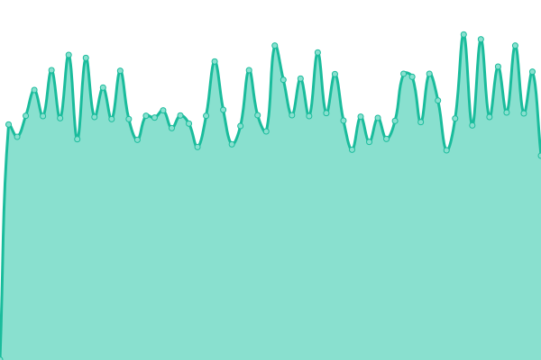

# [📈 Live Status](https://ticketopen.github.io): <!--live status--> **🟩 All systems operational**

This repository contains the open-source uptime monitor and status page for [티켓오픈](https://ticketopen.github.io), powered by [Upptime](https://github.com/upptime/upptime).

With [Upptime](https://upptime.js.org), you can get your own unlimited and free uptime monitor and status page, powered entirely by a GitHub repository. We use [Issues](https://github.com/TicketOpen/status/issues) as incident reports, [Actions](https://github.com/TicketOpen/status/actions) as uptime monitors, and [Pages](https://ticketopen.github.io) for the status page.

<!--start: status pages-->
<!-- This summary is generated by Upptime (https://github.com/upptime/upptime) -->
<!-- Do not edit this manually, your changes will be overwritten -->
<!-- prettier-ignore -->
| URL | Status | History | Response Time | Uptime |
| --- | ------ | ------- | ------------- | ------ |
|  [Melon Ticket](https://ticket.melon.com) | 🟩 Up | [melon-ticket.yml](https://github.com/TicketOpen/status/commits/HEAD/history/melon-ticket.yml) | 

 771ms
     
 | 

<a href="https://TicketOpen.github.io/status/history/melon-ticket">100.00%</a>
    

|  [Interpark Ticket](http://ticket.interpark.com) | 🟩 Up | [interpark-ticket.yml](https://github.com/TicketOpen/status/commits/HEAD/history/interpark-ticket.yml) | 

 862ms
     
 | 

<a href="https://TicketOpen.github.io/status/history/interpark-ticket">100.00%</a>
    

|  [YES24 Ticket](http://ticket.yes24.com) | 🟩 Up | [yes-24-ticket.yml](https://github.com/TicketOpen/status/commits/HEAD/history/yes-24-ticket.yml) | 

 1114ms
     
 | 

<a href="https://TicketOpen.github.io/status/history/yes-24-ticket">100.00%</a>
    

|  [Ticketlink](https://ticket.wemakeprice.com) | 🟩 Up | [ticketlink.yml](https://github.com/TicketOpen/status/commits/HEAD/history/ticketlink.yml) | 

 879ms
     
 | 

<a href="https://TicketOpen.github.io/status/history/ticketlink">100.00%</a>
    

|  [WE MAKE CURTURE](https://ticket.wemakeprice.com) | 🟩 Up | [we-make-curture.yml](https://github.com/TicketOpen/status/commits/HEAD/history/we-make-curture.yml) | 

 157ms
     
 | 

<a href="https://TicketOpen.github.io/status/history/we-make-curture">100.00%</a>
    

|  [NAVER LIVE](https://live.naver.com) | 🟩 Up | [naver-live.yml](https://github.com/TicketOpen/status/commits/HEAD/history/naver-live.yml) | 

 909ms
     
 | 

<a href="https://TicketOpen.github.io/status/history/naver-live">100.00%</a>
    

|  [V LIVE](https://www.vlive.tv) | 🟩 Up | [v-live.yml](https://github.com/TicketOpen/status/commits/HEAD/history/v-live.yml) | 

 1264ms
     
 | 

<a href="https://TicketOpen.github.io/status/history/v-live">100.00%</a>
    

<!--end: status pages-->

[**Visit our status website →**](https://ticketopen.github.io)

## 📄 License

- Powered by: [Upptime](https://github.com/upptime/upptime)
- Code: [MIT](./LICENSE) © [티켓오픈](https://ticketopen.github.io)
- Data in the `./history` directory: [Open Database License](https://opendatacommons.org/licenses/odbl/1-0/)
